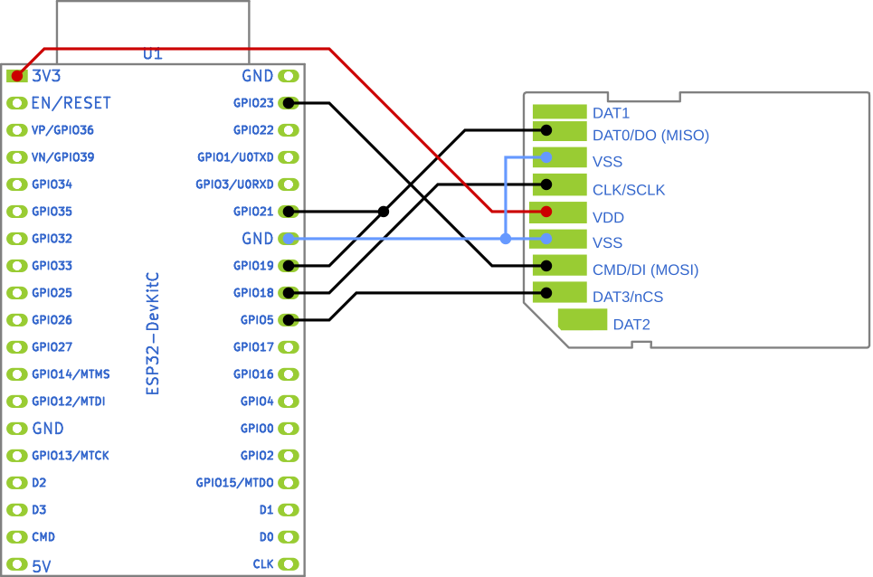
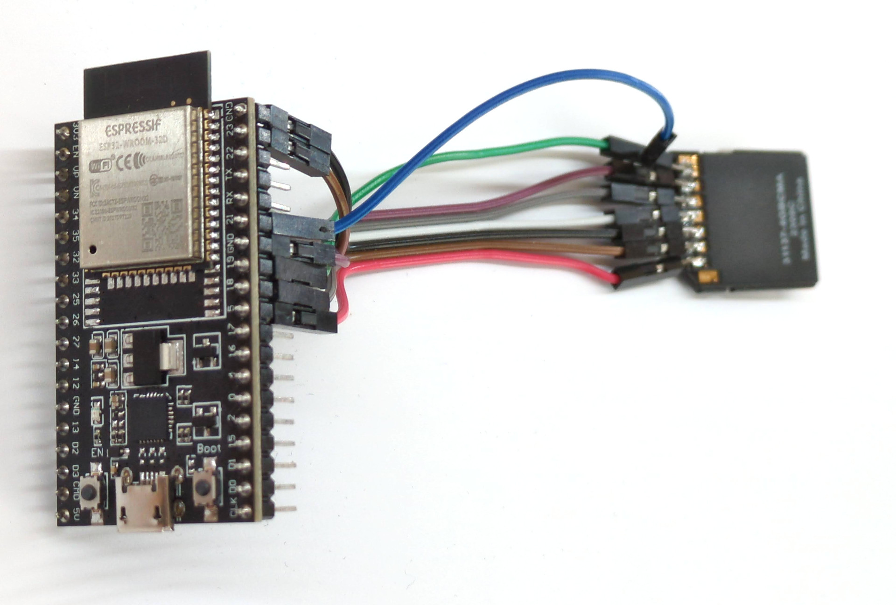

# SDWebRecovery ­— File and Binary Image Recovery Tool for Broken SD Cards

> An ESP32-based tool for SD card recovery and raw data retrieval via SPI 
> interface, delivering files to your computer over Wi-Fi through a web 
> interface

## Overview

SDWebRecovery is a tool designed to (try to) recover single files and raw “`dd`-esque” image dumps from a malfunctioning SD card using the SPI interface and an ESP32 microcontroller.

If your SD card reader does not detect the SD card as being inserted, accessing it via SPI could be still a viable technique to recover data from it.

With this tool, data is served via HTTP over Wi-Fi, allowing simple browsing and file download through a web browser / `wget`.

### Why not SDWebServer?

In comparison to the [SDWebServer](https://github.com/espressif/arduino-esp32/blob/master/libraries/WebServer/examples/SDWebServer/SDWebServer.ino) example, SDWebRecovery can output the raw image of the full SD card, and has the file writing / editing capabilities disabled (to avoid altering your data by accident).

## Features

- **SPI Interface:** Utilize the SPI interface to establish a connection between the ESP32 and the broken SD card for data retrieval.
- **raw binary image:** Obtain a raw dump of the SD card, which can be used for further offline data recovery (e.g. through Photorec).
- **HTTP server over Wi-Fi:** Transmit recovered data to the host computer over Wi-Fi, accessible through a web browser.
- **Transfer speeds:** approx. 150-300 kB/sec.

## Getting Started

### Prerequisites

- VS Code with PlatformIO (ESP32 board support installed)
- SD card
- Jumper wires
- SD card breakout board / soldering iron

### Installation

1. Clone the repository to your local machine.
   
   ```bash
   git clone https://github.com/GiMo84/SDWebRecovery.git
   ```

2. Open VS Code and load the project.

3. Modify the Wi-Fi credentials in `src/main.cpp` to match your network settings.

4. Upload the sketch to the ESP32.

## Usage

1. Connect the broken SD card to the ESP32 using the SPI interface, as shown below:
   
   

2. Power the ESP32 via USB and monitor the connection process through the serial monitor (baud rate: 115200 bps).

3. Once connected, access the web interface by navigating to the provided IP address in your web browser.
   
   * To browse the contents of SD card, visit http://esp32sd.local/list?dir=/
   
   * To retrieve the binary image of the SD card, visit http://esp32sd.local/raw

## Contributing

Contributions are welcome! If you have ideas for improvements or new features, feel free to submit a pull request.

## Notes

* The circuit does not require level shifting as the ESP32 already operates at 3.3V.

* The code tries to use mDNS to register the address http://esp32sd.local . YMMV.

* The pull-up to 3.3V on DO/MISO might not be necessary. I abused a GPIO pin of the ESP32 as a pull-up due to a lack of resistors; a conventional 50 kΩ pull-up might be a better solution.

* You can use an adapter or solder wires directly to the SD card (see below). The pitch of the contacts is 2.54 mm, hence Dupont connectors fit perfectly.
  
  

## Acknowledgments

The tool leverages extensively the code from the [SDWebServer](https://github.com/espressif/arduino-esp32/blob/master/libraries/WebServer/examples/SDWebServer/SDWebServer.ino) example of the WebServer library for Arduino.
